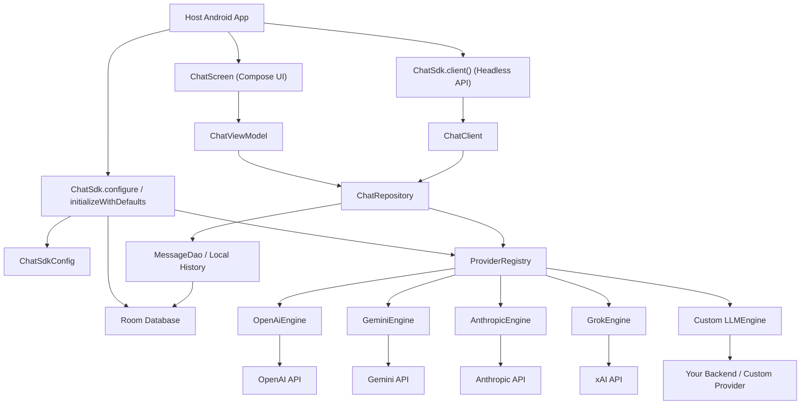
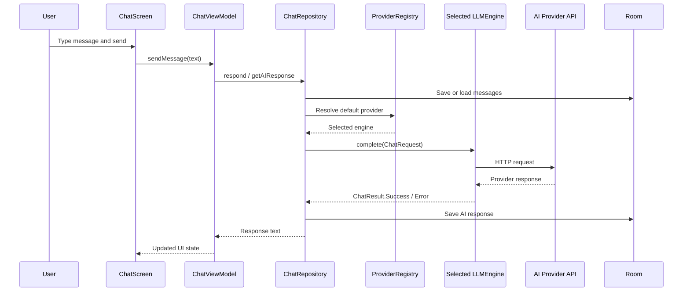
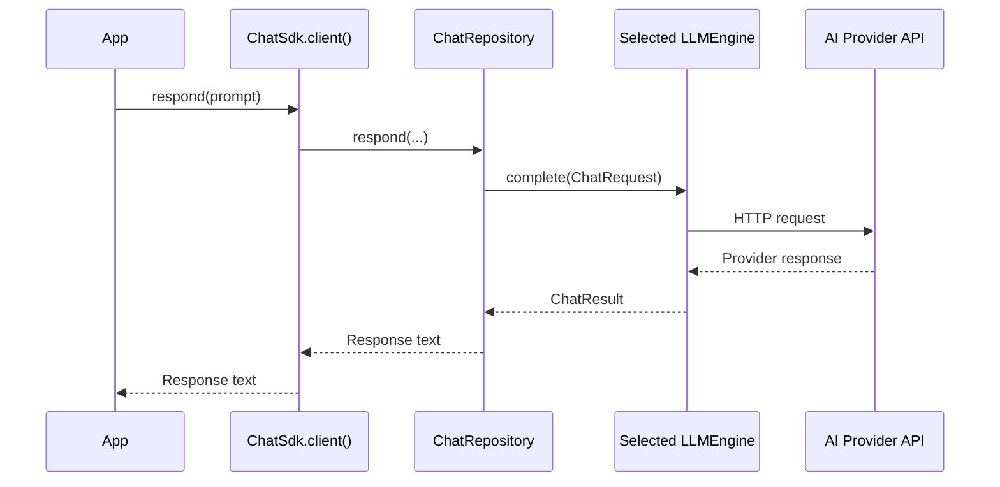
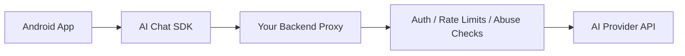

# High-Level Architecture

AI Chat SDK for Android is split into three main layers: app integration, SDK core, and provider engines. Apps can either use the bundled Compose UI or call the headless client directly.

## System Diagram



## Layer Responsibilities

| Layer | Main Classes | Responsibility |
| --- | --- | --- |
| App integration | `ChatSdk`, `ChatSdkConfig`, `ChatSdkConfigBuilder` | Initialize the SDK, select provider, pass credentials, choose models, update config at runtime. |
| Compose UI | `ChatScreen`, `ChatViewModel`, UI components | Render chat, collect user input, show messages, loading state, and typing indicator. |
| Headless API | `ChatClient` | Let apps request model responses without using the bundled UI. |
| Repository | `ChatRepository` | Build chat payloads, apply persona prompts, choose provider, persist history when requested. |
| Provider runtime | `ProviderRegistry`, `LLMEngine`, `ChatRequest`, `ChatResult` | Register engines and route requests to the selected provider. |
| Provider engines | `OpenAiEngine`, `GeminiEngine`, `AnthropicEngine`, `GrokEngine` | Translate SDK requests into provider-specific HTTP payloads and parse responses. |
| Persistence | `AppDatabase`, `MessageDao`, `MessageEntity` | Store and stream local chat history through Room. |

## Request Flow With Compose UI



## Request Flow With Headless API



## Configuration Model

`ChatSdkConfig` controls:

- `defaultProvider`: active provider.
- `credentials`: provider credentials such as API keys or Gemini `google.json`.
- `providerModels`: model ID per provider.
- `defaultPersonaPrompt`: optional default system/persona prompt.
- `usePersonaByDefault`: whether to use the default persona automatically.
- `persistHistoryForHeadless`: whether headless calls should read/write local history.
- `databaseName`: Room database name.

Example:

```kotlin
ChatSdk.configure(applicationContext) {
    defaultProvider = ProviderId.OPEN_AI
    openAI(BuildConfig.OPENAI_KEY, model = "gpt-4.1")
}
```

## Provider Extensibility

The SDK routes all model calls through `LLMEngine`. Built-in engines are registered by `ChatSdk.initializeWithDefaults(...)` and `ChatSdk.applyConfig(...)`.

Apps can provide their own engine for a backend proxy or unsupported provider:

```kotlin
class BackendChatEngine(
    private val api: BackendChatApi
) : LLMEngine {
    override val providerId = ProviderId.OPEN_AI

    override suspend fun complete(request: ChatRequest): ChatResult {
        return runCatching {
            api.complete(request.messages, request.model).reply
        }.fold(
            onSuccess = { ChatResult.Success(it) },
            onFailure = { ChatResult.Error(it) }
        )
    }
}
```

Register it:

```kotlin
ChatSdk.initialize(applicationContext)
ChatSdk.registerEngine(BackendChatEngine(api))
```

## Production Deployment Shape

For public apps, provider API keys should live on your backend, not inside the APK.



This lets the mobile app use the same SDK UI and headless API while your backend controls credentials, allowed models, quotas, and provider-specific policy.

## Current Boundaries

- The bundled UI is Compose-first.
- Direct provider keys are intended for demos, internal apps, and local validation.
- Streaming responses are not yet part of the shipped SDK.
- Tools, RAG, embeddings, and encrypted local storage are roadmap items.
